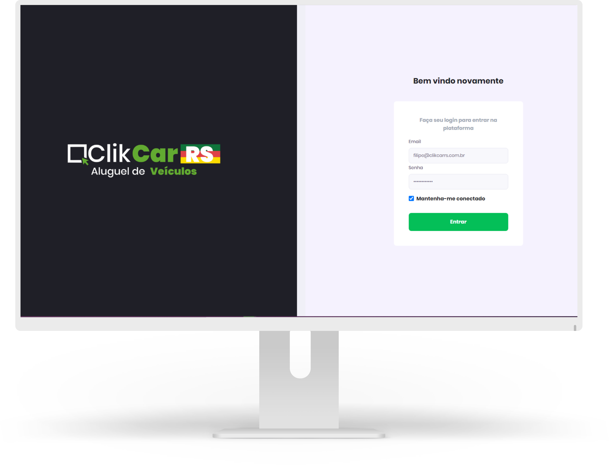

<strong>Sistema de gestão para empresas </strong> 
de aluguel de veículos

 
 
<h1>Sobre o projeto</h1>

Projeto se baseia na necessidade da empresa <a href="https://clikcarrs.com.br">ClkCar RS</a> 

O projeto abrange as seguintes áreas.

<ul>
    <li>Financeiro</li>
    <li>Contrato</li>
    <li>Veiculos</li>
    <li>Pagamentos e recebimentos</li>
    <li>Controle de Multas</li>
    <li>Controle de CNH</li>
    <li>Controle da Manutenção</li>
    <li>Checklist do locação/devolução do veículo</li>
</ul> 
 
 

---

<h3 align="center" >Vamos nos conectar 😉</h3>

  &ensp;
  &ensp;
  

 

    Desenvolvido 💜 por Filipe Batista 

